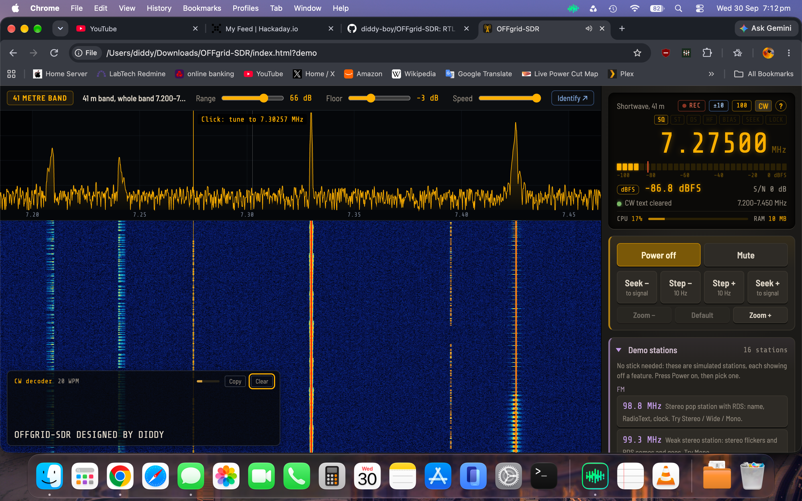
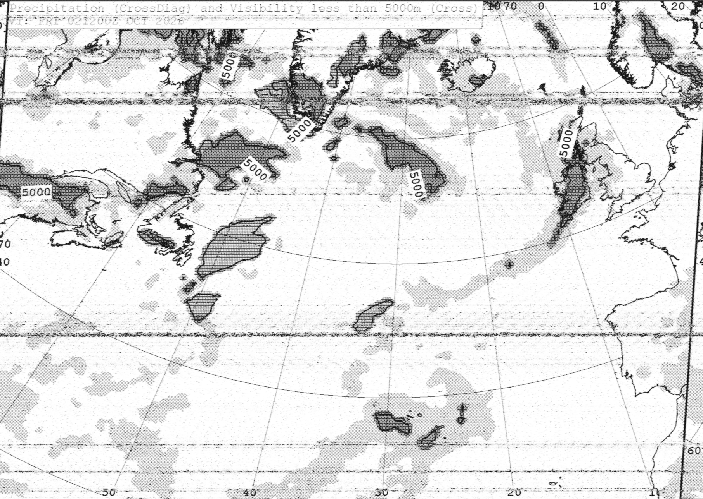
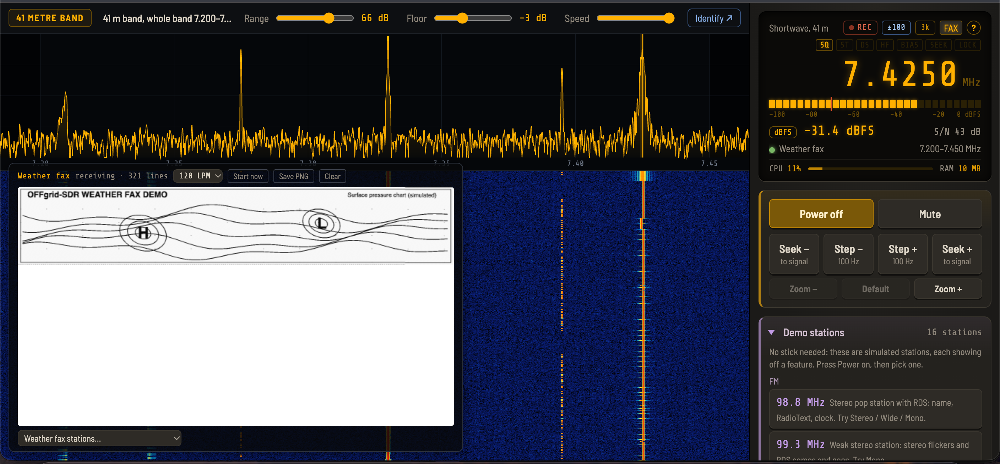
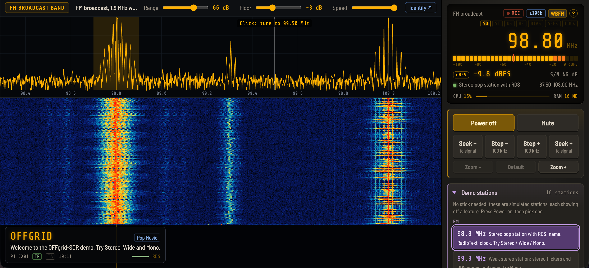

# OFFgrid-SDR

**A complete radio receiver in a single file. No installation, no internet, no account: plug in an RTL-SDR stick, open the page, and listen.**

OFFgrid-SDR is a full software-defined radio receiver that runs entirely in your web browser from one file. Put the `index.html` on a USB pen drive with an RTL-SDR stick and an antenna, and you have a working shortwave, FM, airband and VHF/UHF receiver on almost any computer: no software to install, no administrator rights, no drivers to download on site (on most systems), and nothing that ever needs an internet connection.





## Demo video

[](https://youtu.be/TMCA4gI8UnE)

## Why I made this

The humble RTL-SDR stick needs some love. It has always been treated as an add-on: a cheap way into other SDR software, never the star of the show. I decided to change that, and build a receiver made for the RTL-SDR, that anyone can carry on a pen drive and use anywhere.

---

## What's new in 1.4

- **Waterfall replay:** pause the waterfall, draw a box around any signal from the last 15–60 seconds, and replay it in a zoomed window, in any mode, with its own filters. Decode Morse from just that section, loop part of it, and save it as MP3 plus a raw IQ file for other SDR software.
- **AUTO:** switch it on and OFFgrid-SDR works out what each signal is and switches to the right mode by itself, on every band. It even recognises DRM digital broadcasts.
- **Six new decoders:** **RTTY**, **NAVTEX**, **DSC** (ships' distress calls), **SSTV** (slow-scan TV pictures), **PSK31** and **Hellschreiber**.
- **Frequency calibration** against a time station, measured to a fraction of a hertz.
- **A new mode layout:** the same ten buttons on every band, with the specialist modes under **More ▾**.
- **CW tuning help:** click near a Morse signal to snap exactly onto it, or press **Z** to zero-beat.
- Plus an RDS status line, an FPS readout, many new demo stations, and a long list of fixes.

---

## Built for places without internet

Most SDR software assumes you can download it, install it, and often fetch maps or updates online. OFFgrid-SDR assumes none of that. It was designed for situations like these:

- **Remote stations and expeditions.** A research station in Antarctica, a ship at sea or a remote field camp: send out a stick, an antenna and a pen drive, and the people there can listen to shortwave news, weather fax charts, NAVTEX safety messages and more, with no internet at all.
- **Emergency and resilience kits.** When the internet or the power grid is down, radio still works. The whole receiver fits on a pen drive in a grab bag.
- **Remote signal monitoring.** Leave it running for hours, record what it hears, and save weather fax charts automatically, all offline.
- **Locked-down or shared computers.** Schools, libraries, work laptops and Chromebooks often block installing software. OFFgrid-SDR is just a page you open.
- **Privacy.** Nothing leaves your computer. The page makes no network requests at all; your settings and memories stay in your browser. The one exception is the optional **Identify** menu, which looks up the tuned frequency online, and only when you click it.

---





## What you need

| | |
|---|---|
| **An RTL-SDR stick** | Tested with the **RTL-SDR Blog V4** (recommended: shortwave works with no adapter, and it has a 4.5 V bias-tee), the RTL-SDR Blog V3, and the **Nooelec NESDR SMArt v5**. Other RTL2832U sticks with an R820T, R820T2 or R828D tuner should work too. |
| **An antenna** | The telescopic antenna that comes with most sticks is fine for FM. For medium wave and shortwave, tested with the **AURSINC GA800** active loop and the **YouLoop** passive magnetic loop (which folds up small for travel). |
| **A browser with WebUSB** | Google Chrome, Microsoft Edge, or another Chromium-based browser (Opera, Vivaldi, Chromium). Tested on Windows 11, macOS Tahoe and ChromeOS. Firefox and Safari don't support WebUSB. |

### Sending a kit somewhere without internet

Pack the stick, an antenna, the cables, and a USB pen drive containing:

- `index.html` (the whole receiver), plus `README.txt`, the offline guide, so the people there can look things up without internet;
- a settings backup with memories for the stations you expect (made with *Receiver settings → Export settings*);
- [Zadig](https://zadig.akeo.ie) for any Windows computer, since there'll be no way to download it on site;
- a browser installer, in case the computer there doesn't have a suitable one (Windows 10/11 already has Edge).

Before sending it, you can also **calibrate the stick** against a time station (see below): the correction is saved in the settings backup, so it arrives already accurate.

---

## Quick start

OFFgrid-SDR is **one file**: `index.html`. That's all you need; everything else in this repository is documentation and licences.

1. **Download `index.html`:** click it in the file list above, then click the **Download raw file** button (the download arrow at the top right of the file view). Save it anywhere, a USB pen drive included. (To get everything, the README and licences too, use **Code → Download ZIP** at the top of this page.)
2. Open `index.html` in Chrome or Edge.
3. Plug in the stick, press **Power on**, and choose the stick in the browser's USB chooser.

**No stick yet?** Open `index.html?demo` for **demo mode**: simulated stations that show off every feature, including FM stereo with RDS, fading shortwave, SSB, Morse, a weather fax chart, RTTY and NAVTEX bulletins, a DSC distress call, an SSTV test card, PSK31, Hellschreiber, a DRM broadcast and the famous "Buzzer". Press Power on, then pick a station from the Demo stations list.

### One-time driver setup

- **Windows:** run [Zadig](https://zadig.akeo.ie), choose *Options → List All Devices*, select *Bulk-In, Interface (Interface 0)* (or *RTL2838UHIDIR*), choose **WinUSB** and click **Replace Driver**.
- **macOS:** no configuration needed.
- **Chromebooks:** no configuration needed.
- **Linux:** stop the TV driver from claiming the stick, and give your user access to it:
  ```sh
  echo 'blacklist dvb_usb_rtl28xxu' | sudo tee /etc/modprobe.d/rtl-sdr-blacklist.conf
  sudo modprobe -r rtl2832_sdr dvb_usb_rtl28xxu        # or reboot
  echo 'SUBSYSTEM=="usb", ATTRS{idVendor}=="0bda", ATTRS{idProduct}=="2838", MODE="0666"' | sudo tee /etc/udev/rules.d/20-rtlsdr.rules
  sudo udevadm control --reload-rules && sudo udevadm trigger
  ```
  Then unplug the stick and plug it back in. With Snap Chromium on Ubuntu, also run `sudo snap connect chromium:raw-usb`.

Only one program can use the stick at a time, so close SDR#, SDR++, gqrx or rtl_tcp first.

---

## What it can do

### Bands

- **FM broadcast** (87.5–108 MHz): stereo, with RDS station names, RadioText and clock.
- **Medium wave** and **shortwave**, with one-click buttons for every international broadcast band (120 m to 11 m). Each opens the whole band on the waterfall.
- **Amateur bands:** 160 m to 10 m, **2 m** and **70 cm**.
- **PMR446:** all 16 licence-free walkie-talkie channels, stepping channel by channel.
- **Airband** (118–137 MHz) in 2 MHz sections, with **8.33 kHz channel steps** and channel names (type 118.505 and you're on the right channel).
- **Mystery:** famous unexplained HF stations, including **The Buzzer (UVB-76)**, The Pip, The Squeaky Wheel and other Russian military "channel markers".
- **Any other frequency** from 100 kHz to 1766 MHz: type it in (for example `198k`, `162.025`, `1090M`) and it opens in general coverage mode.
- Each band remembers its own mode and tuning step, so clicks always land on that band's channels.

### Modes

The same ten buttons on every band:

**AUTO · FM · AM · SAM · SAM-U · SAM-L · USB · LSB · CW · More ▾**

- **FM** is wideband on the FM broadcast band (stereo, RDS) and narrowband everywhere else (repeaters, PMR446, marine).
- **SAM** is synchronous AM, which stops fading distortion. **SAM-U and SAM-L** use just one sideband, to dodge a neighbouring station splattering into the other side: a feature usually found only on specialist receivers.
- **More ▾** holds the decoders (RTTY, PSK31, NAVTEX, DSC, weather fax, SSTV, Hellschreiber) and explicit Wide or Narrow FM.
- Modes that don't fit where you're tuned are **greyed out**, with the reason in the tooltip, so the row never changes shape.

### AUTO

Switch **AUTO** on, and every time you tune somewhere new OFFgrid-SDR listens for a couple of seconds, works out what the signal is, switches to the right mode and tunes onto it. A banner at the top of the waterfall shows it listening, then what it found and how sure it is.

| Where | What AUTO recognises |
|---|---|
| **Shortwave** | CW, RTTY, PSK31, NAVTEX, DSC, weather fax, SSTV, Hellschreiber, AM and SSB (it even judges USB or LSB from the voice itself) |
| **VHF / UHF** | Narrowband FM and airband AM |
| **FM broadcast band** | Wideband FM |
| **Anywhere on HF** | **DRM** digital broadcasts, which it tells you about (they can't be decoded in a browser) |

If nothing is clear, it picks the band's usual mode: the ham band's sideband (LSB on 160, 80 and 40 m; USB on 60 m and from 30 m up), AM on broadcast bands and the airband, and narrowband FM elsewhere on VHF/UHF. Choose a mode yourself to switch AUTO off.

### Decoders

- **RDS** on FM: station name, programme type, RadioText and clock, with a status line (*searching*, *no data*, or *locked · 98% good*) so you can tell "no RDS" from "signal too weak for RDS".
- **Morse (CW) decoder:** learns the sending speed by itself (4 to 60 words per minute) and ignores voice and noise. Copy the decoded text with one click.
- **CW tuning help:** click near a Morse signal to tune exactly onto it, or press **Z** to zero-beat a nearby signal onto the tone.
- **RTTY:** radioteletype from weather and news stations and radio amateurs. It finds the shift (170, 425, 450 or 850 Hz) and the speed (45.45, 50 or 75 baud) by itself.
- **NAVTEX:** maritime safety and weather messages on 518 kHz, 490 kHz and 4209.5 kHz, with each message's station, subject and number. Damaged characters are repaired from their second copy.
- **DSC (Digital Selective Calling):** ships' distress, urgency, safety and routine calls on the HF DSC frequencies, listed with who called whom (MMSI numbers). Distress calls are shown in red.
- **SSTV (slow-scan TV):** pictures in the Martin, Scottie and PD formats, drawn line by line as they arrive and saved as PNG. On shortwave (14.230 MHz) and VHF (the ISS on 145.800 MHz during its SSTV events).
- **PSK31:** keyboard-to-keyboard ham text. Click a signal to snap onto it.
- **Hellschreiber:** the tone paints the letters on a scrolling strip and you read them by eye, just like the original 1930s machines.
- **Weather fax:** decodes HF radiofax charts line by line, lines them up automatically, and saves them as full-resolution PNG images, including automatic saving of every chart. A station list covers the German, UK and US weather fax services.

### Waterfall replay

Ever heard something interesting a moment too late? Switch on the **waterfall buffer** (15, 30 or 60 seconds), and OFFgrid-SDR keeps the raw radio signal in memory.

1. Press **⏸** on the waterfall to freeze it.
2. Draw a box around any signal from the last few seconds.
3. A **replay window** opens with a zoomed, detailed view of that moment, and plays it on a loop.

In the replay window you can:

- choose its **own mode, filter, SSB shift and noise filters** without touching your main settings;
- **retune** within the box by clicking, or with the arrow keys or mouse wheel;
- **decode Morse** from just that section;
- loop just part of it with **A/B**;
- **Save** it as an MP3 of what you're hearing, plus a **raw IQ file** named so that SDR#, SDR++ and other SDR software open it at the right frequency.

### Listening tools

- **Spectrum and waterfall:** click anywhere to tune, or use the mouse wheel. **Zoom** in up to 256× around the signal, handy for SSB and CW.
- **Panorama:** sweeps the stick across a wider range than it can see at once and stitches the slices together, showing **up to 10 MHz at once**. Choose **Around me** (centred where you're tuned, 2–10 MHz wide) or the HF slices **0.5–10**, **10–20** and **20–28.8 MHz**. Click a signal to tune to it and listen, or click Panorama again to go back to where you were.
- **Noise reduction**, a **noise blanker** for clicks from electric fences and car ignition, a **mains-hum filter** (50 or 60 Hz), and an **auto notch** that removes steady whistles from AM and SSB.
- **SSB filter widths** of 1.8 to 2.8 kHz (one click on the filter badge) and a **passband shift** to dodge a neighbouring station.
- **Squelch** based on signal-to-noise ratio: a clean on/off gate, like a real radio, that doesn't need resetting when you change antenna or gain.
- **Seek** to the next signal, variable **filter widths**, and an **S-meter**.
- **Scan** your memories: pick any of them, set the squelch, and Scan hops through them, stopping on any with a signal and carrying on 3 seconds after it ends.
- **Frequency calibration:** pick a time station (RWM, WWV/WWVH/BPM or CHU) and press Calibrate. OFFgrid-SDR measures the carrier to a fraction of a hertz and sets the stick's correction for you.
- **Identify** (when online): "What's on this frequency?" searches the web for the tuned frequency, "Ask AI" asks Google's AI Mode what's likely there, given the frequency, mode and time, and "Shortwave radio schedule" (below 30 MHz) shows who is scheduled on that frequency, from [shortwave.live](https://shortwave.live). Nothing is sent until you click.
- **CPU, RAM and FPS** readouts, so you can see how hard the page is working.
- Keeps playing when you switch to another browser tab.

### Recording and settings

- **Record** to MP3 or WAV.
- **50 memories**, each remembering frequency, mode and filters, including the SSB width and shift.
- **Settings backup:** export everything to a small file and import it on another computer, ideal for preparing a kit before it's sent out.

---

## Known limitations

- **Browser support:** WebUSB is only available in Chromium-based browsers (Chrome, Edge, Opera and so on). Firefox and Safari can run demo mode only.
- **One program at a time** can use the stick.
- **Weather fax:** in June 2026 the US National Weather Service proposed closing its five HF radiofax stations towards the end of 2026. They're marked in the station list and will be removed once the closure is confirmed.
- **Morse:** the first letter of a transmission may be missed while the decoder locks on, especially at high speeds.
- **Audio delay:** the sound runs about 0.2 s behind the waterfall. Bluetooth headphones add their own delay on top.
- **Below about 500 kHz** (longwave), reception is weaker than on medium wave and shortwave.
- **Panorama** looks at one slice at a time, so short bursts elsewhere in the range can be missed. A 10 MHz sweep takes around half a second, depending on the stick, and there's no audio while it sweeps.
- **Waterfall replay** uses memory: 2 bytes per sample, about 123 MB for 30 seconds at 2.048 MS/s (246 MB for 60 seconds), which is why it's off by default. A selection can't cross a retune.
- **AUTO** judges a couple of seconds of signal, so it can be wrong, especially on weak signals and with the SSB sideband. If something sounds wrong, choose the mode yourself.
- **DRM** digital broadcasts are recognised but can't be decoded: their audio codecs aren't available in browsers and are tied up in licensing.
- **SSTV on 40 m and 80 m** is sent in LSB, which the SSTV mode doesn't handle yet; 20, 15 and 10 m and the ISS work.
- **DSC calls** last only about 6 seconds, so weak or fading ones can be missed. Unreadable digits are shown as ??, never as wrong numbers.
- **Nooelec and other direct-sampling sticks:** on shortwave the signal bypasses the tuner, so the RF gain slider has no effect there (it's greyed out, with an explanation). The RTL-SDR Blog V4 isn't affected.

---

 visits and counting!

## Credits and licences

OFFgrid-SDR is built on the work of others:

- [**@jtarrio/webrtlsdr**](https://github.com/jtarrio/webrtlsdr) by Jacobo Tarrío: the WebUSB driver for the RTL2832U and its tuners, including the RTL-SDR Blog V4's HF upconverter. Apache License 2.0.
- [**@jtarrio/signals**](https://github.com/jtarrio/signals) by Jacobo Tarrío: the signal processing, including the FFT, filters, and the FM, AM, SAM (with its selectable sidebands), SSB and CW demodulators. Apache License 2.0.
- **Google Radio Receiver**, the original Chrome app these libraries grew from.
- [**Osmocom rtl-sdr**](https://osmocom.org/projects/rtl-sdr), for working out how to use these USB TV sticks as software-defined radios.
- [**RTL-SDR Blog**](https://www.rtl-sdr.com), for the V4 hardware and their open-source driver work.
- [**lamejs**](https://github.com/zhuker/lamejs), the JavaScript port of the LAME MP3 encoder. LGPL.
- [**Barlow Semi Condensed**](https://github.com/jpt/barlow) and [**Share Tech Mono**](https://fonts.google.com/specimen/Share+Tech+Mono) fonts. SIL Open Font License.
- [**esbuild**](https://esbuild.github.io), which bundles everything into a single file that runs offline.
- [**Zadig**](https://zadig.akeo.ie) by Pete Batard, for installing the WinUSB driver on Windows.
- [**Shortwave.Live**](https://shortwave.live), the schedule database the Identify menu's "Shortwave radio schedule" opens.
- Frequencies for the Mystery stations come from [**Priyom**](https://priyom.org).
- PSK31 and its Varicode alphabet were created by **Peter Martinez, G3PLX**.

The full licence texts are in the `licenses` folder.

<!-- OFFgrid-SDR's own licence: add a LICENSE file (for example MIT or Apache 2.0) and name it here. -->

---

## Support

OFFgrid-SDR is free. If it's useful to you, you can [**buy me a coffee**](https://buymeacoffee.com/billynomates1974). ☕

73!
